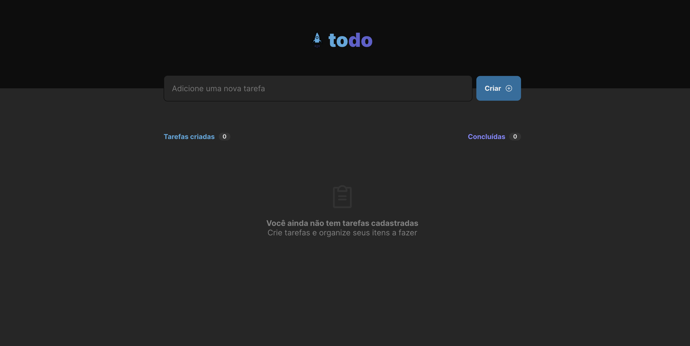
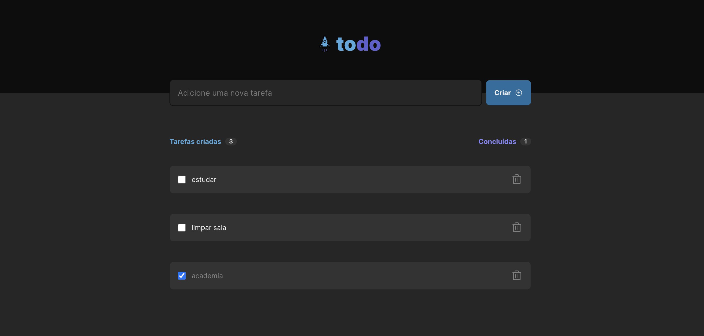

# To Do List

## Overview
This project was designed as a challenge from Rocketseat's Ignite. The challenge was to create a To Do list by converting a Figma design and using React.This application was created using Vite with React and Typescript.

## Table of Contents

- [Description](#description)
- [Deployed Application](#deployed-application)
- [Contributing](#contributing)
- [Questions](#questions)

## Description
 - When The user opens the To Do list, they are presented with an input field to enter a new task.
 - When there is no task listed, a message indicating that the to do list is empty will be displayed.
 - When there is a task listed, the user will be able either to check the task when it is completed successfully or to delete it by clicking the trash icon.
 - The user will be presented with the count of the tasks created and the tasks completed on the top of the list.

 

 

 

 ## Contributing
   Isaaccna
    
  ## Questions
   For any questions about the project, please visit my:  
   GitHub Profile: [isaaccna](https://github.com/isaaccna)  
   or  
   Email: @ isaac.andrade1231@gmail.com